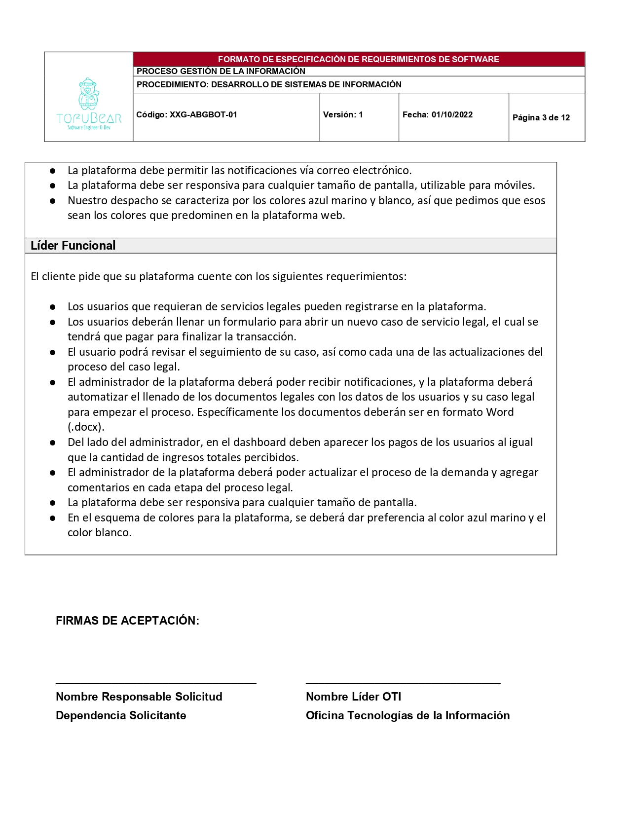
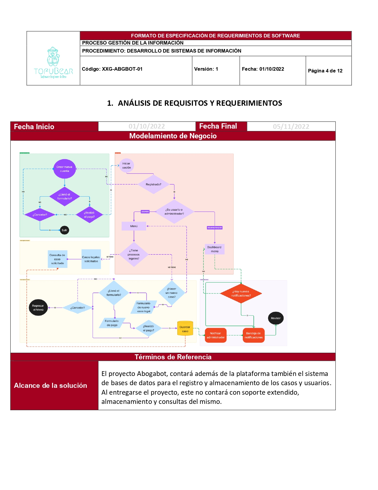
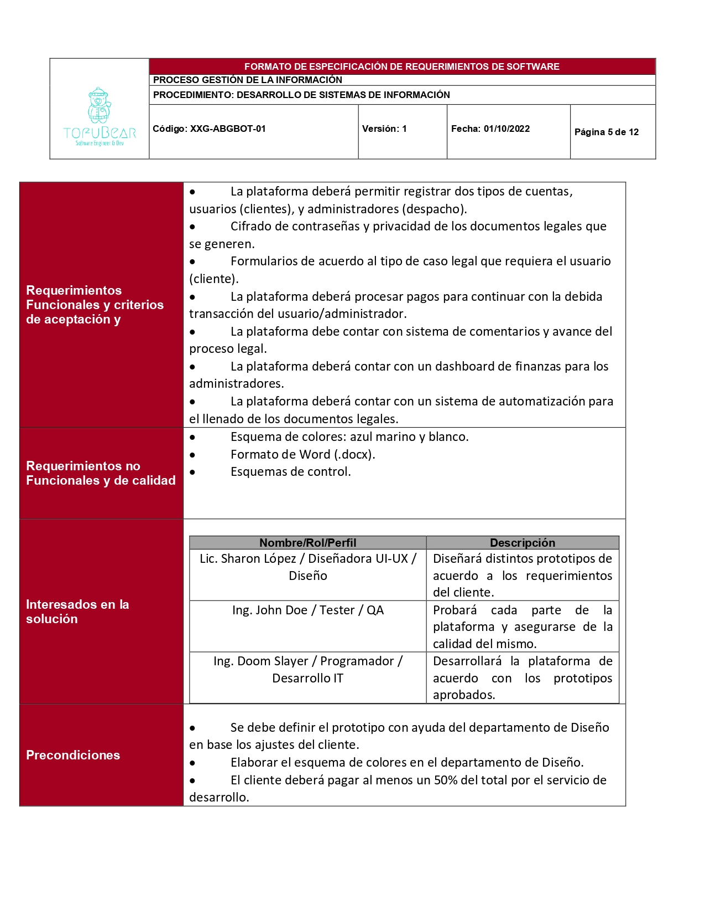

# Caso *AbogaBot*

## Toma de requerimientos
- [x] Descripción general del requerimiento
- [X] Fase de normalización
- [X] Análisis de requisitos y requerimientos
  - [X] Modelamiento de negocio
  - [ ] Términos de referencia
- [ ] Fase de planeación y gerencia del proyecto
- [ ] Levantamiento del requerimiento detallado
- [ ] Diseño de la arquitectura de solución

### Descripción general del requerimiento

---
### Fase de normalización

---
### Análisis de requisitos y requerimientos

**Modelo**

>Revisar este modelo con más detallen en [Figma](https://www.figma.com/file/Z3lIEyvq5Hh6lu8tiGGe8D/Modelado-Abogabot?node-id=0%3A1)

---
### Fase de planeación y gerencia del proyecto

---
Ir a la sección anterior: [Toma de requerimientos](./02.-Abogabot-Requerimientos.md)

Ir a la siguiente sección: [Buyer Persona](./02.1.-Abogabot-BuyerPersona.md)