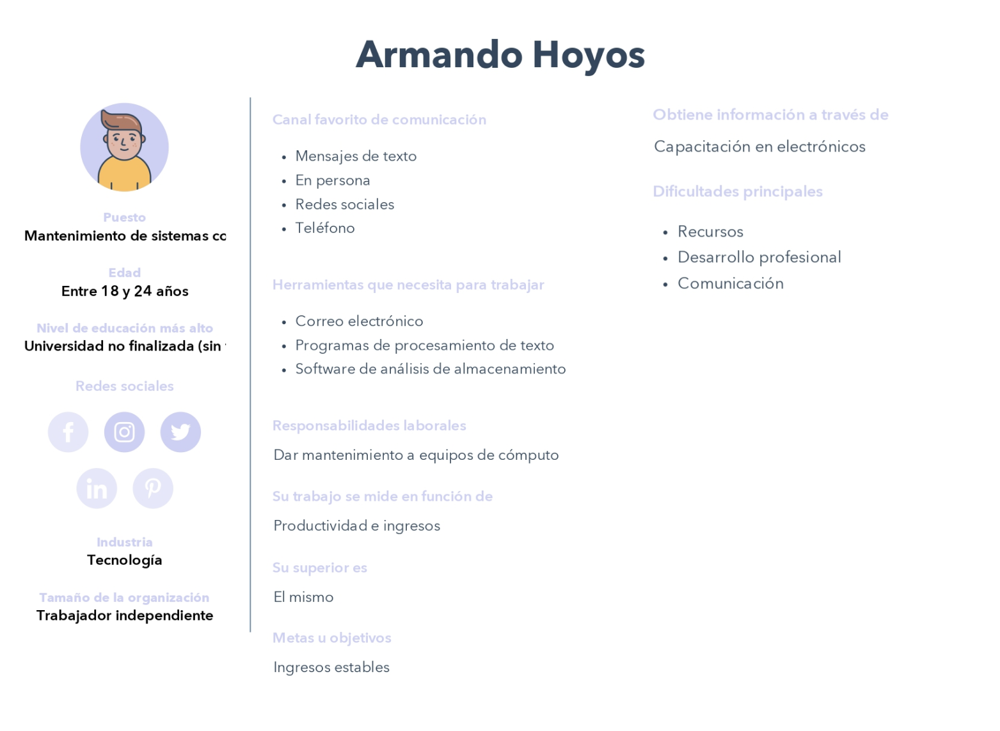
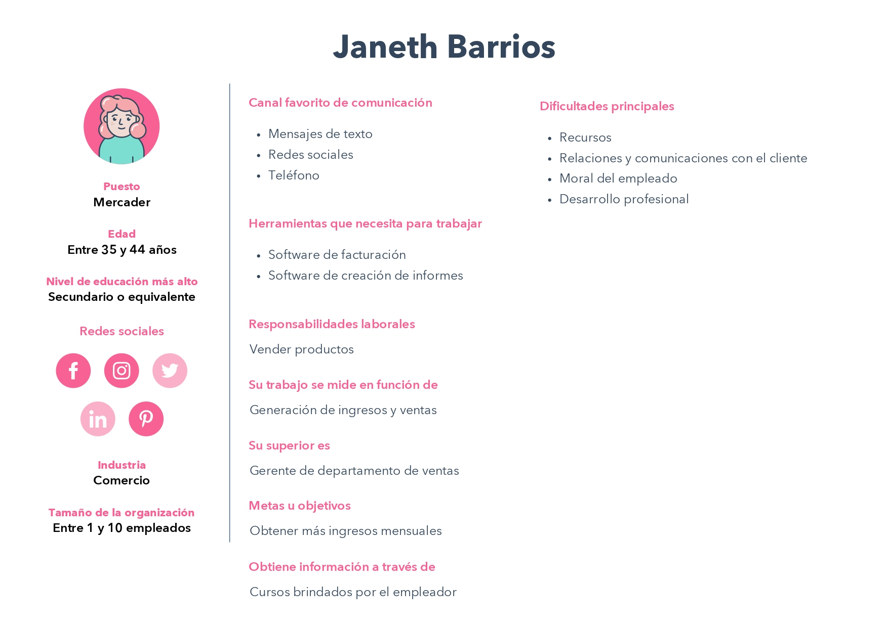
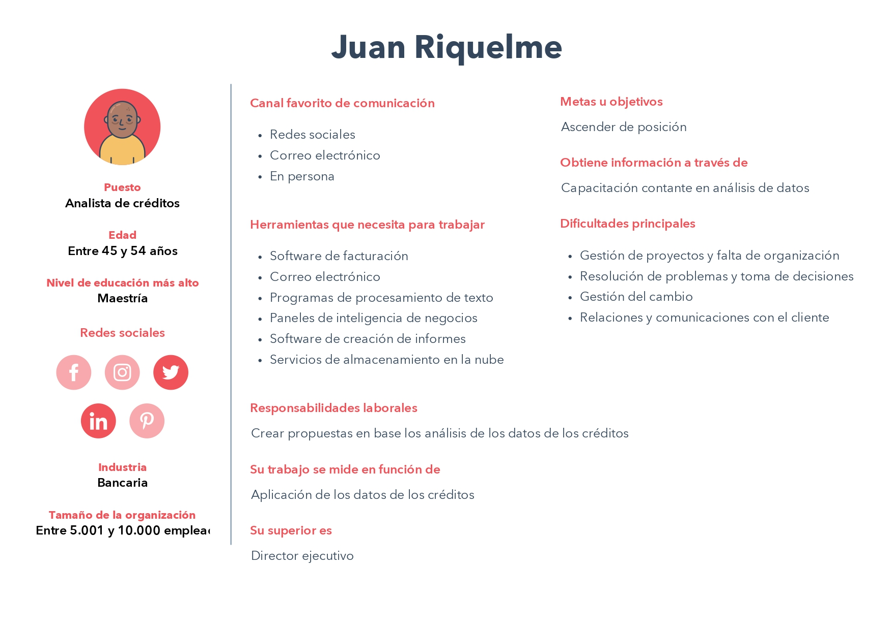

# Caso: *AbogaBot*

## Buyer persona
Representación ficticia del posible cliente (usuario) de la plataforma web *AbogaBot*, están basadas en datos reales sobre el comportamiento y las características demográficas de los clientes.

 

Posibles perfiles
- [X] Caso 1: **Armando Hoyos**
- [X] Caso 2: **Janeth Barrios**
- [X] Caso 3: **Juan Riquelme**

 

---

 

### Buyer persona 1: **Armando Hoyos**

 

>Armando da mantenimiento a sistemas computacionales.

 

---

 

### Buyer persona 2: **Janeth Barrios**

 

>Janeth es una mercader, y se encarga de la venta.

 

---

 

### Buyer persona 3: **Juan Riquelme**

 

>Juan es un analista de créditos en un banco importante de México.

 

---

 

Ir a la sección anterior: [Requerimientos](./02.-Abogabot-Requerimientos.md)

Ir a la siguiente sección: [Buyer Persona](./03.-Abogabot-PublicoObjetivo.md)