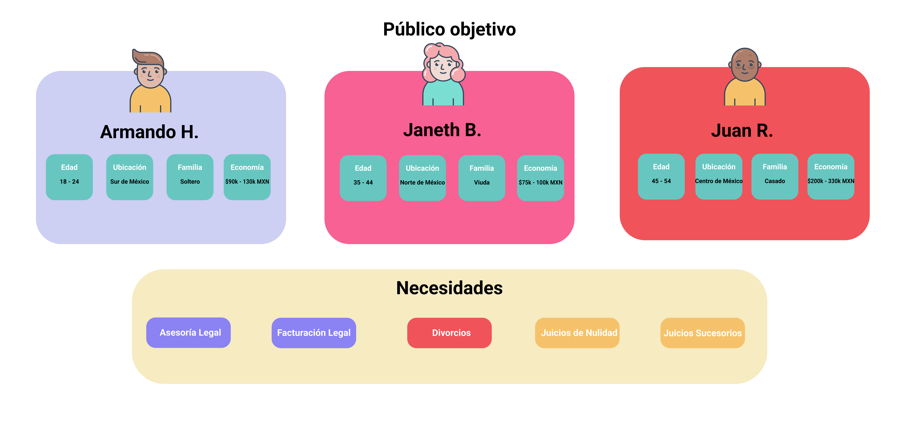

# Caso: *AbogaBot*

## Público Objetivo
En base el modelo de negocio se definió el público objetivo a quienes les interesaría y podrían consumir el producto o servicios de **AbogaBot**.

 

>Para ver el modelo en más detalle ver en [Figma](https://www.figma.com/file/uJDYOGS1qka4HPI4GCllkY/Publico-Objetivo?node-id=0%3A1)

 

---

 

---

 

Ir a la sección anterior: [Buyer Persona](./02.1.-Abogabot-BuyerPersona.md)

Ir a la siguiente sección: [Wireframe UX](./04.-Abogabot-WireframeUX.md)